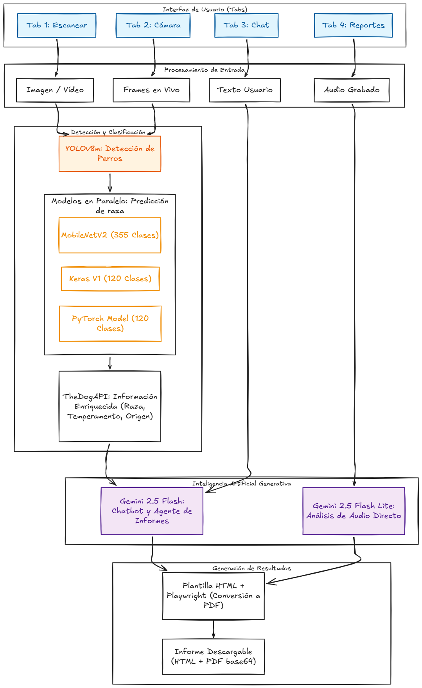

# 🐶 PawSense

PawSense es una aplicación de inteligencia artificial que analiza **imágenes, vídeos, GIFs y transmisiones en tiempo real** para estimar la raza de un perro. Además, permite generar **informes veterinarios para empresas** y **informes de adiestramiento para usuarios particulares**.

El sistema utiliza modelos de visión por computador para detectar rasgos morfológicos y generar una **predicción probabilística**, mostrando el porcentaje estimado de cada raza identificada.

## 🚀 Características

- Análisis de imágenes  
- Procesamiento de vídeo y GIF  
- Detección en tiempo real  
- Predicción probabilística de razas  
- ChatBot conversacional integrado  
- Agente de IA generador de informes (Veterinario / Adiestramiento)  

## 📌 Recursos del Proyecto

| Tipo | Descripción | Enlace |
| :--- | :--- | :--- |
| 🌍 **Web** | Aplicación desplegada en producción | [Ir al sitio](https://pawsense-iabd.vercel.app/) |
| 🛠️ **Core** | Repositorio principal (Frontend & Backend) | [Ver Código](https://github.com/PawSense-IABD/PawSense) |
| 🤖 **ML** | Notebooks de entrenamiento y modelos | [Modelos](https://github.com/PawSense-IABD/PawSenseTFNotebookAndModel) / [Pipeline](https://github.com/PawSense-IABD/pawsense-pipeline-notebook) |
| 📺 **Presentación** | Presentación en PDF del proyecto | [Ver Presentación](#) |
| 📽️ **Vídeo** | Vídeo explicativo del proyecto en YouTube | [Ver Video](#) |

## 👥 Equipo y Participación

| [ <b>Víctor Jiménez</b>](https://github.com/vjimgue) | [ <b>Enrique Moreno</b>](https://github.com/enri081) | [ <b>Carlos Cerezo</b>](https://github.com/carloscl2005) | [ <b>Denisa Belean</b>](https://github.com/denibel04) |
| :---: | :---: | :---: | :---: |
| 25% | 25% | 25% | 25% |

 

https://github.com/user-attachments/assets/72b53ea6-716d-4ac3-a272-696e7ca3c787

 

---

## Previews de la Aplicación

A continuación se presentan demostraciones visuales de las funcionalidades principales del sistema:

| Módulo | Enlace al Vídeo |
|:--- |:--- |
| Chatbot Conversacional | [Reproducir Demostración](https://github.com/user-attachments/assets/fc40cfd2-b669-45ab-ba9c-6ed1a8efa64a) |
| Predicción de Imágenes | [Reproducir Demostración](https://github.com/user-attachments/assets/50903328-a7ea-42e0-b749-01c82d530881) |
| Agente de Informes | [Reproducir Demostración](https://github.com/user-attachments/assets/500cad2c-506f-4fbe-9bac-e0fb7dc1d528) |
| Análisis de Vídeo | [Reproducir Demostración](https://github.com/user-attachments/assets/0ede8214-1a7b-46f3-a348-fa5ee8ebc40e) |

 

## 🧠 ¿Cómo funciona?

### Análisis y Predicción de Razas
1. **Entrada de Datos**: Procesamiento de archivos multimedia (imágenes, vídeos, GIFs) o captura de frames mediante la cámara en tiempo real.
2. **Detección de Objetos**: Localización y segmentación del ejemplar canino utilizando el modelo **YOLOv8m**.
3. **Clasificación Multimodelo**: Análisis simultáneo de rasgos morfológicos mediante tres modelos de visión por computador en paralelo. Un algoritmo de consenso unifica los resultados para ofrecer una predicción probabilística final.
4. **Enriquecimiento de Información**: Consulta automática a **TheDogAPI** para recuperar metadatos específicos como temperamento, esperanza de vida y rasgos característicos.

### Interacción Mediante Chatbot
5. **Interfaz Conversacional**: Sistema de chat integrado para la resolución de consultas sobre la predicción obtenida o cuidados generales.
6. **Gestión de Contexto**: El asistente mantiene el historial de la sesión y los datos técnicos de la detección para ofrecer respuestas precisas mediante streaming de texto.

### Generación Inteligente de Informes
7. **Exportación a Documento**: El Agente de IA procesa la información técnica y genera archivos PDF especializados:
    * **Informe Veterinario**: Enfocado en predisposiciones genéticas, salud preventiva y cuidados médicos sugeridos.
    * **Informe de Adiestramiento**: Centrado en pautas conductuales, técnicas de refuerzo y socialización.
8. **Procesamiento de Voz**: Capacidad de generar informes a partir de grabaciones de audio, realizando transcripción automática y extracción de entidades relevantes para el documento final.

 

## 🎯 Casos de uso

- **Protectoras y refugios**: Identificación aproximada de perros sin documentación.  
- **Clínicas veterinarias**: Apoyo informativo sobre posibles predisposiciones.
- **Adiestradores caninos**: Obtener consejos sobre como mejorar el entrenamiento.  
- **Usuarios particulares**: Conocer mejor el perfil genético y conductual de su mascota.  

 

## 📊 Obtención de Datos

Para el entrenamiento y validación de los modelos de inteligencia artificial, se han utilizado los siguientes conjuntos de datos abiertos:

| Dataset | Descripción | Imágenes | Fuente |
| :--- | :--- | :---: | :--- |
| **Stanford Dogs Dataset** | Dataset de referencia con 120 razas de perros de todo el mundo. | 20,580 | [Kaggle](https://www.kaggle.com/datasets/jessicali9530/stanford-dogs-dataset) |
| **Dog Breed Dataset** | Colección de imágenes con las 355 razas aprobadas por el FCI. | 12,500 | [GitHub](https://github.com/AtharvaTaras/Dog-Breeds-Dataset) |

### 📖 Documentación técnica adicional

Para un análisis detallado de la implementación, limpieza de datos y entrenamiento, puedes consultar los siguientes repositorios:

* 📓 **Análisis y Modelado:** [Notebooks de los modelos de Stanford](https://github.com/PawSense-IABD/PawSenseTFNotebookAndModel) — Contiene el proceso de entrenamiento, validación y exportación de los modelos de Keras y Pytorch con el dataset de Standford.
* ⚙️ **Pipeline de Predicción:** [Modelo Dog Breed e Infraestructura](https://github.com/PawSense-IABD/pawsense-pipeline-notebook) — Detalla entrenamiento del modelo con el modelo de Dog Breed Dataset y el flujo de datos y la automatización de las predicciones.

 

## 🏗️ Pipeline del Sistema

A continuación se detalla el flujo técnico desde la entrada de datos hasta la generación de los informes finales:

 

## 🛠 Tecnologías

- **Detección**: YOLOv8m (fine-tuned)  
- **Clasificación**: MobileNetV2 · EfficientNet-B0 · CNN propia (Keras)  
- **IA Generativa**: Gemini 2.5 Flash / Flash Lite  
- **Backend**: Python · FastAPI  
- **Frontend**: Angular 19 · Angular Material · Ionic
- **Generación PDF**: Playwright  
- **API externa**: TheDogAPI
 
 

## 📚 Recursos utilizados

Para el desarrollo de PawSense se han empleado los siguientes conjuntos de datos, APIs y documentación técnica:

- [Manual y Documentación Oficial Angular](https://angular.dev/docs)
- [Dataset Standford Dogs](https://www.kaggle.com/datasets/jessicali9530/stanford-dogs-dataset)
- [Dataset Dog Breed Identification](https://www.kaggle.com/c/dog-breed-identification/data) 
- [Web Oficial TheDogAPI](https://thedogapi.com/)
- [Manual de integración TheDogAPI](https://docs.thedogapi.com/)
- [Documentación de Gemini API](https://ai.google.dev/gemini-api/docs)
- [Manual de Playwright Python](https://playwright.dev/python/docs/api/class-page#page-pdf)

